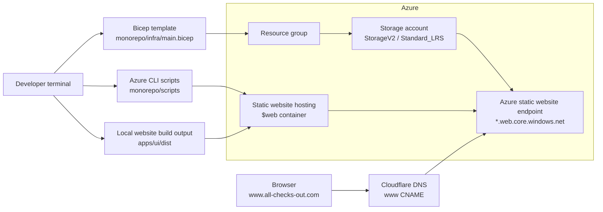

# Azure 03 - Deploy To A Registered Domain

## Overview

This lesson deploys the same static website hosting pattern as Azure02, then points a registered domain at the Azure static website endpoint.

The Azure infrastructure is deliberately small:

- one Azure resource group
- one Azure Storage account
- Blob static website hosting enabled on that storage account
- the special `$web` container used by Azure static website hosting

The registered domain is managed in Cloudflare. The only manual DNS change used for this lesson is one proxied `www` CNAME record that points to the Azure static website endpoint.

## How The Registered Domain Works

There is no change to `monorepo/infra/main.bicep` for this lesson.

Azure02 already creates the Azure infrastructure we need: a StorageV2 account with Blob static website hosting enabled. Azure gives that static website a public endpoint ending in `web.core.windows.net`.

Azure03 keeps that Azure infrastructure the same. The registered domain is added by creating one Cloudflare DNS record:

```text
www.all-checks-out.com CNAME azure02xxxxxxxxp4ruuk.z33.web.core.windows.net
```

Because the record is proxied by Cloudflare, visitors use the registered domain:

```text
https://www.all-checks-out.com
```

Cloudflare then forwards the request to the Azure static website endpoint.

## Deployment Steps

Run commands from the repository root.

Install dependencies:

```bash
pnpm --dir monorepo install
```

Deploy the Azure infrastructure, build the website, upload it, and print the Azure static website endpoint:

```bash
pnpm --dir monorepo run deploy-everything
```

The final command prints a URL like this:

```text
https://azure02xxxxxxxxp4ruuk.z33.web.core.windows.net/
```

Use that Azure endpoint as the target for the Cloudflare `www` CNAME record.

In Cloudflare DNS, add one CNAME record:

```text
Type: CNAME
Name: www
Target: azure02xxxxxxxxp4ruuk.z33.web.core.windows.net
Proxy status: Proxied
```

For this deployment, the DNS record is:

```text
www.all-checks-out.com.  1  IN  CNAME  azure02xxxxxxxxp4ruuk.z33.web.core.windows.net. ; cf_tags=cf-proxied:true
```

After Cloudflare has saved the record, visit:

```text
https://www.all-checks-out.com
```

## Architecture



## Prerequisites

You need:

- Node.js
- pnpm
- Azure CLI
- an Azure subscription
- a signed-in Azure CLI session
- a registered domain managed in Cloudflare

Check your Azure CLI account:

```bash
az account show --output table
```

Sign in if needed:

```bash
az login
```

Select a subscription if your account has access to more than one:

```bash
az account set --subscription "<subscription-id-or-name>"
```

## Configuration

The scripts use these defaults from `monorepo/scripts/config.sh`:

```bash
AZURE_LOCATION="${AZURE_LOCATION:-uksouth}"
AZURE_RESOURCE_GROUP="${AZURE_RESOURCE_GROUP:-azure02-static-website-rg}"
AZURE_DEPLOYMENT_NAME="${AZURE_DEPLOYMENT_NAME:-azure02-static-website}"
AZURE_APP_NAME="${AZURE_APP_NAME:-azure02web}"
AZURE_STORAGE_AUTH_MODE="${AZURE_STORAGE_AUTH_MODE:-key}"
UI_DIST_DIR="${UI_DIST_DIR:-apps/ui/dist}"
```

Override values inline when needed:

```bash
AZURE_LOCATION=westeurope AZURE_RESOURCE_GROUP=my-static-site-rg pnpm --dir monorepo run deploy-everything
```

## Infrastructure

`monorepo/infra/main.bicep` is intentionally unchanged from Azure02.

That is the main infrastructure lesson in this repository: the Azure resources do not need to change just because the site is reached through a registered domain. The Azure Storage account still serves the website from its static website endpoint.

The registered-domain infrastructure is the Cloudflare DNS record. It is added manually in Cloudflare:

```text
www.all-checks-out.com.  1  IN  CNAME  azure02xxxxxxxxp4ruuk.z33.web.core.windows.net. ; cf_tags=cf-proxied:true
```

This maps `www.all-checks-out.com` to the Azure static website endpoint while Cloudflare proxies the request.

## Scripts

- `infra:deploy` creates the resource group, deploys Bicep, reads the storage account name, and enables Blob static website hosting.
- `infra:what-if` previews the Bicep deployment.
- `ui:build` builds the website into `apps/ui/dist`.
- `ui:upload` uploads `apps/ui/dist` into the `$web` container.
- `ui:url` prints the storage account's `primaryEndpoints.web` URL.
- `deploy-website` builds and uploads the website.
- `deploy-everything` deploys infrastructure, builds the website, uploads it, and prints the Azure static website endpoint.
- `infra:destroy` deletes the resource group.

## Project Structure

```text
.
├── README.md
└── monorepo
    ├── apps
    │   └── ui
    ├── infra
    │   └── main.bicep
    ├── scripts
    │   ├── config.sh
    │   ├── deploy-infra.sh
    │   ├── destroy-infra.sh
    │   ├── show-url.sh
    │   ├── upload-ui.sh
    │   └── what-if-infra.sh
    ├── package.json
    ├── pnpm-lock.yaml
    └── pnpm-workspace.yaml
```

## Troubleshooting

If upload fails because the build output is missing, run:

```bash
pnpm --dir monorepo run ui:build
```

If `ui:url` cannot find a URL, deploy the infrastructure first:

```bash
pnpm --dir monorepo run infra:deploy
```

If the registered domain does not load immediately, wait for the Cloudflare DNS change to propagate and then try `https://www.all-checks-out.com` again.
